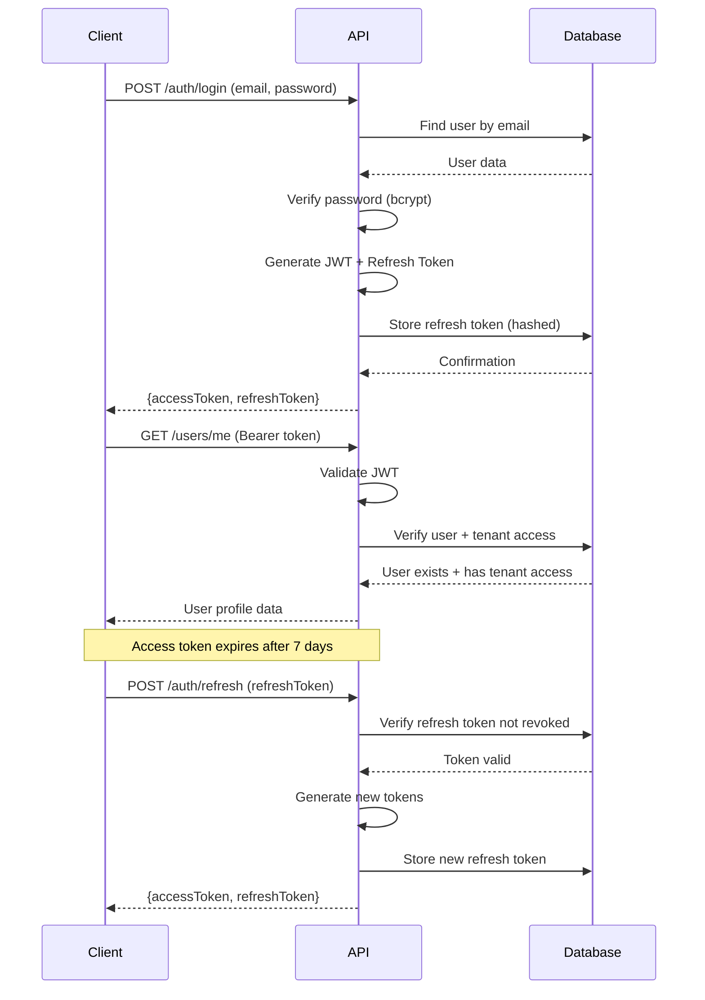

# Authentication System

This guide explains the JWT-based authentication system with refresh token support and tenant-aware validation.

## Authentication Flow



## Components

### 1. Registration

**Endpoint**: `POST /auth/register`

```typescript
{
  "email": "user@example.com",
  "password": "SecurePass123!",
  "firstName": "John",
  "lastName": "Doe",
  "tenantId": "optional-existing-tenant-id"
}
```

**Process**:
1. Validate input (DTO validation)
2. Check if user exists
3. Hash password with bcrypt (12 rounds)
4. Create user record
5. If `tenantId` provided, join existing tenant as MEMBER
6. Otherwise create a new tenant + OWNER membership
7. Generate JWT tokens
8. Store refresh token (hashed with SHA-256)
9. Return tokens + user data

### 2. Login

**Endpoint**: `POST /auth/login`

```typescript
{
  "email": "user@example.com",
  "password": "SecurePass123!"
}
```

**Process**:
1. Find user by email
2. Verify password with bcrypt
3. Get user's first tenant
4. Generate JWT with `tenantId`
5. Generate and store refresh token
6. Return tokens

**Rate Limiting**: 5 requests/minute via `AuthThrottlerGuard`

### 3. Token Refresh

**Endpoint**: `POST /auth/refresh`

```typescript
{
  "refreshToken": "eyJhbGc..."
}
```

**Process**:
1. Decode and verify refresh token JWT
2. Check token in database (not revoked)
3. Verify user still exists
4. Preserve `tenantId` from original token
5. Generate new access + refresh tokens
6. Revoke old refresh token
7. Store new refresh token
8. Return new tokens

### 4. Logout

**Endpoint**: `POST /auth/logout`

**Headers**: `Authorization: Bearer {accessToken}`

**Process**:
1. Extract user from JWT
2. Find and revoke all user's refresh tokens
3. Prevent future use of compromised tokens

### 5. Invitation Acceptance

**Endpoint**: `POST /auth/accept-invitation`

```typescript
{
  "token": "invitation-uuid",
  "password": "SecurePass123!",  // Only if new user
  "firstName": "Jane",            // Only if new user
  "lastName": "Smith"             // Only if new user
}
```

**Process**:
1. Validate invitation token (not expired, not accepted)
2. **If user exists**: Link to tenant with invited role
3. **If new user**: Create account + link to tenant
4. Mark invitation as accepted
5. Generate JWT with invitation's `tenantId` as active
6. Return tokens + user data

## JWT Structure

### Access Token Payload

```typescript
interface JwtPayload {
  sub: string;        // User ID
  tenantId: string;   // Active tenant ID
  email?: string;     // User email (optional)
  iat: number;        // Issued at timestamp
  exp: number;        // Expiration timestamp
}
```

**Example**:
```json
{
  "sub": "123e4567-e89b-12d3-a456-426614174000",
  "tenantId": "987fcdeb-51a2-43d7-9012-345678901234",
  "email": "john@example.com",
  "iat": 1640000000,
  "exp": 1640604800
}
```

### Refresh Token Payload

Same structure as access token, but with longer expiration (30 days default).

## JWT Strategy

Located at `src/modules/auth/strategies/jwt.strategy.ts`

**Validation Process**:

```typescript
async validate(payload: JwtPayload) {
  // 1. Verify user exists
  const user = await this.userRepository.findById(payload.sub);
  if (!user) {
    throw new UnauthorizedException('User no longer exists');
  }

  // 2. Verify user has access to tenant
  const hasAccess = await this.tenantRepository.userHasAccessToTenant(
    payload.sub,
    payload.tenantId
  );

  if (!hasAccess) {
    throw new UnauthorizedException('Access to tenant revoked');
  }

  // 3. Return user context (attached to request.user)
  return {
    userId: payload.sub,
    tenantId: payload.tenantId,
    email: payload.email,
  };
}
```

**Security Features**:
- Validates user still exists
- Validates user still has tenant access
- Checks on every request (not just at login)
- Prevents use of tokens after access revocation

## Password Security

### Hashing

Uses bcrypt with 12 rounds:

```typescript
import * as bcrypt from 'bcrypt';

// Hash password
const hashedPassword = await bcrypt.hash(password, 12);

// Verify password
const isValid = await bcrypt.compare(password, user.password);
```

### Password Requirements

Enforced via `@IsStrongPassword()` decorator:

- Minimum 8 characters
- At least 1 uppercase letter
- At least 1 lowercase letter
- At least 1 number
- At least 1 special character

**Example valid passwords**:
- `MySecure123!`
- `P@ssw0rd2024`
- `Admin#2024Pass`

## Refresh Token Management

### Storage

Refresh tokens are stored via the `RefreshToken` TypeORM entity (`src/modules/auth/entities/refresh-token.entity.ts`).

```typescript
@Entity('refresh_tokens')
export class RefreshToken {
  @PrimaryGeneratedColumn('uuid')
  id: string;

  @Column({ unique: true })
  token: string; // SHA-256 hash of the refresh JWT

  @Column()
  userId: string;

  @Column()
  expiresAt: Date;

  @Column({ default: false })
  revoked: boolean;

  @ManyToOne(() => User, (user) => user.refreshTokens, { onDelete: 'CASCADE' })
  user: User;
}
```

### Token Hashing

Tokens are hashed with SHA-256 before storage:

```typescript
import * as crypto from 'crypto';

const hashedToken = crypto
  .createHash('sha256')
  .update(refreshToken)
  .digest('hex');

await this.refreshTokenRepository.create({
  token: hashedToken,
  userId,
  expiresAt: new Date(Date.now() + 30 * 24 * 60 * 60 * 1000),
});
```

### Token Revocation

```typescript
// Revoke single token (logout)
await this.refreshTokenRepository.revokeToken(hashedToken);

// Revoke all user tokens (security incident)
await this.refreshTokenRepository.revokeAllUserTokens(userId);
```

## Guards

### JwtAuthGuard

Applied globally to all routes:

```typescript
// src/main.ts
app.useGlobalGuards(new JwtAuthGuard());
```

**Bypass** with `@Public()` decorator:

```typescript
@Public()
@Get('health')
async health() {
  return { status: 'ok' };
}
```

### TenantRoleGuard

Validates user role in active tenant:

```typescript
@UseGuards(JwtAuthGuard, TenantRoleGuard)
@Roles(TenantRole.OWNER, TenantRole.ADMIN)
@Post(':tenantId/invitations')
async createInvitation() {
  // Only OWNER and ADMIN can access
}
```

### AuthThrottlerGuard

Rate limits auth endpoints (5 requests/minute):

```typescript
@UseGuards(AuthThrottlerGuard)
@Post('login')
async login() {
  // Rate limited
}
```

## Security Features

### 1. Token Expiration

| Token Type | Lifespan | Configurable Via |
|-----------|----------|------------------|
| Access Token | 7 days | `JWT_EXPIRATION` |
| Refresh Token | 30 days | `REFRESH_TOKEN_EXPIRATION` |

**Best Practice**: Short access token, longer refresh token

### 2. Token Revocation

- Logout revokes refresh tokens
- Prevents reuse of stolen tokens
- Database check on every refresh

### 3. Password Strength

- Enforced via validation
- Bcrypt hashing (12 rounds)
- No password reuse (can be implemented)

### 4. Rate Limiting

- Global: 100 requests/minute
- Auth endpoints: 5 requests/minute
- Prevents brute force attacks

### 5. Tenant Validation

- JWT strategy checks tenant access
- Revoked access = invalid token
- Real-time validation on every request

### 6. CORS

- Configured allowed origins
- Prevents unauthorized domains
- Credentials support enabled

### 7. Security Headers

Helmet middleware enabled:
- X-Frame-Options
- X-Content-Type-Options
- Strict-Transport-Security
- X-DNS-Prefetch-Control

## Common Workflows

### Workflow 1: User Registration & Login

```typescript
// 1. Register
POST /auth/register
{
  "email": "john@example.com",
  "password": "SecurePass123!",
  "firstName": "John",
  "lastName": "Doe"
}

// Response
{
  "accessToken": "eyJhbGc...",
  "refreshToken": "eyJhbGc...",
  "user": { ... },
  "tenant": { "id": "uuid", "name": "John's Workspace", "role": "OWNER" }
}

// 2. Use access token for requests
GET /users/me
Authorization: Bearer eyJhbGc...

// 3. When token expires, refresh
POST /auth/refresh
{
  "refreshToken": "eyJhbGc..."
}

// 4. Logout when done
POST /auth/logout
Authorization: Bearer eyJhbGc...
```

### Workflow 2: Invitation-Based Registration

```typescript
// 1. Admin invites user
POST /tenants/{tenantId}/invitations
{
  "email": "jane@example.com",
  "role": "MEMBER"
}

// 2. Jane accepts invitation (new user)
POST /auth/accept-invitation
{
  "token": "invitation-uuid",
  "password": "SecurePass123!",
  "firstName": "Jane",
  "lastName": "Smith"
}

// Response includes JWT with invited tenant as active
{
  "accessToken": "eyJhbGc...",
  "user": { ... },
  "tenant": { "id": "tenant-uuid", "role": "MEMBER" }
}
```

### Workflow 3: Tenant Switching

```typescript
// 1. Check available tenants
GET /users/me/tenants

// Response
{
  "tenants": [
    { "id": "uuid-1", "name": "Company A", "role": "OWNER" },
    { "id": "uuid-2", "name": "Company B", "role": "MEMBER" }
  ]
}

// 2. Switch to Company B
POST /users/switch-tenant
{
  "tenantId": "uuid-2"
}

// Response: New JWT with Company B as active tenant
{
  "accessToken": "eyJhbGc...",  // New token
  "refreshToken": "..."
}
```

## Testing Authentication

### Unit Tests

```typescript
describe('AuthService', () => {
  it('should login user and return tokens', async () => {
    const dto = {
      email: 'test@example.com',
      password: 'SecurePass123!',
    };

    const result = await authService.login(dto);

    expect(result.accessToken).toBeDefined();
    expect(result.refreshToken).toBeDefined();
  });

  it('should throw if password invalid', async () => {
    const dto = {
      email: 'test@example.com',
      password: 'WrongPassword',
    };

    await expect(authService.login(dto)).rejects.toThrow(
      UnauthorizedException,
    );
  });
});
```

### E2E Tests

```typescript
describe('Auth (e2e)', () => {
  it('/auth/login (POST)', () => {
    return request(app.getHttpServer())
      .post('/auth/login')
      .send({
        email: 'admin@example.com',
        password: 'password123',
      })
      .expect(200)
      .expect((res) => {
        expect(res.body.accessToken).toBeDefined();
        expect(res.body.refreshToken).toBeDefined();
      });
  });
});
```

## Security Best Practices

1. ✅ **Use HTTPS in production** - Encrypt token transmission
2. ✅ **Store tokens securely** - HttpOnly cookies or secure storage
3. ✅ **Short access token lifespan** - Minimize damage if stolen
4. ✅ **Rotate refresh tokens** - On each refresh, issue new token
5. ✅ **Validate on every request** - Check user and tenant access
6. ✅ **Rate limit auth endpoints** - Prevent brute force
7. ✅ **Hash refresh tokens** - Never store plaintext in database
8. ✅ **Revoke on logout** - Invalidate refresh tokens
9. ✅ **Monitor failed attempts** - Send to Sentry
10. ✅ **Use strong secrets** - Generate with `openssl rand -base64 32`

## Related Documentation

- [Multi-Tenancy System](./multi-tenancy.md) - How tenant validation works
- [API Authentication Endpoints](../api/authentication.md) - API reference
- [Configuration Guide](../getting-started/configuration.md) - JWT secrets setup
