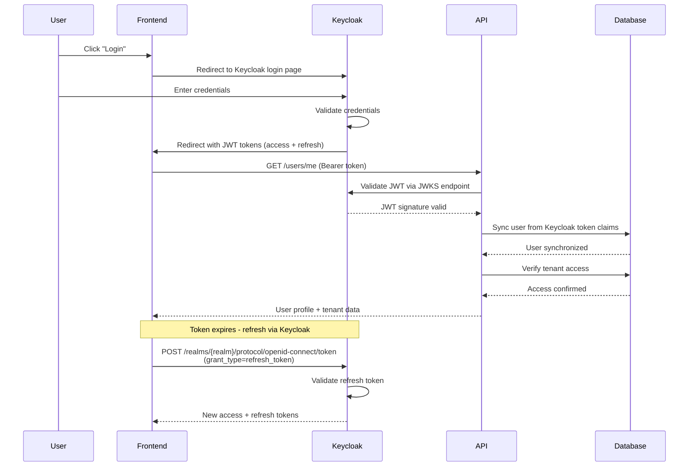

# Authentication System - Pure Keycloak Architecture

This guide explains the **Pure Keycloak authentication** architecture where all JWT token operations are handled by Keycloak, not the API.

## Overview

This application uses a **Pure Keycloak architecture** where:

- ✅ **Keycloak** generates all JWT tokens (access + refresh)
- ✅ **Keycloak** handles token refresh via its own endpoints
- ✅ **Keycloak** manages user authentication and password policies
- ✅ **API** validates Keycloak JWTs using JWKS (public key endpoint)
- ✅ **API** synchronizes user data from Keycloak to local database
- ✅ **API** manages tenant relationships and invitations

**⚠️ IMPORTANT**: The API does NOT generate JWT tokens. Only Keycloak does.

## Authentication Flow



## Available Endpoints

The API provides **only 3 authentication-related endpoints**:

### 1. Accept Invitation

**Endpoint**: `POST /auth/accept-invitation`

Accepts a tenant invitation and links the user to a tenant.

**Request**:
```json
{
  "token": "invitation-uuid"
}
```

**Process**:
1. Validates invitation (not expired, not already accepted)
2. Finds or creates minimal user record in local database
3. Links user to tenant with specified role
4. Marks invitation as accepted
5. Returns success message

**Response**:
```json
{
  "message": "Invitation accepted successfully. Please log in via Keycloak to access the tenant.",
  "user": {
    "email": "user@example.com",
    "firstName": null,
    "lastName": null
  },
  "tenant": {
    "id": "tenant-uuid",
    "name": "Company Name"
  },
  "role": "MEMBER",
  "redirectToKeycloak": true,
  "keycloakLoginHint": "user@example.com"
}
```

**Note**: The user must then log in via Keycloak to receive JWT tokens. The API does NOT generate tokens.

**Location**: `api/src/modules/auth/auth.controller.ts:36`

### 2. Reset Password

**Endpoint**: `POST /auth/reset-password`

Triggers Keycloak to send a password reset email.

**Request**:
```json
{
  "email": "user@example.com"
}
```

**Process**:
1. Finds user by email in local database
2. Verifies user has `keycloakId` (linked to Keycloak)
3. Calls Keycloak Admin API to send reset password email
4. Returns success message (doesn't reveal if user exists)

**Response**:
```json
{
  "message": "If a user with this email exists, a password reset email has been sent."
}
```

**Location**: `api/src/modules/auth/auth.controller.ts:51`

### 3. Get Current User

**Endpoint**: `GET /auth/me`

Returns the authenticated user profile with tenant memberships.

**Headers**: `Authorization: Bearer {keycloak-jwt-token}`

**Response**:
```json
{
  "user": {
    "id": "uuid",
    "email": "user@example.com",
    "firstName": "John",
    "lastName": "Doe",
    "keycloakId": "keycloak-user-uuid"
  },
  "currentTenantId": "active-tenant-uuid",
  "tenants": [
    {
      "id": "tenant-1-uuid",
      "name": "Company A",
      "role": "OWNER"
    },
    {
      "id": "tenant-2-uuid",
      "name": "Company B",
      "role": "MEMBER"
    }
  ]
}
```

**Location**: `api/src/modules/auth/auth.controller.ts:100`

## Endpoints NOT Available

The following endpoints **do NOT exist** in Pure Keycloak architecture:

- ❌ `POST /auth/register` - Use Keycloak user registration
- ❌ `POST /auth/login` - Use Keycloak login page
- ❌ `POST /auth/refresh` - Use Keycloak's token refresh endpoint
- ❌ `POST /auth/logout` - Use Keycloak's logout endpoint

## JWT Validation Strategy

### KeycloakJwtStrategy

**Location**: `api/src/modules/auth/strategies/keycloak-jwt.strategy.ts`

The API uses `KeycloakJwtStrategy` (not `JwtStrategy`) to validate Keycloak-issued tokens.

**Validation Process**:

1. **Extract JWT** from `Authorization: Bearer` header
2. **Fetch public key** from Keycloak JWKS endpoint (cached)
3. **Verify signature** using RS256 algorithm
4. **Validate issuer** and audience claims
5. **Extract user claims** from token payload:
   - `sub` - Keycloak user ID
   - `email` - User email
   - `given_name` - First name
   - `family_name` - Last name
   - `tenantId` - Custom claim (optional)
6. **Sync user** to local database (create/update)
7. **Verify tenant access** if `tenantId` provided
8. **Auto-create tenant** if `tenantId` missing (first login)
9. **Return JWT payload** for request context

**Configuration**:

```typescript
super({
  jwtFromRequest: ExtractJwt.fromAuthHeaderAsBearerToken(),
  ignoreExpiration: false,
  secretOrKeyProvider: passportJwtSecret({
    cache: true,
    rateLimit: true,
    jwksRequestsPerMinute: 10,
    jwksUri: configService.get<string>('keycloak.jwksUri'),
  }),
  issuer: `${authServerUrl}/realms/${realm}`,
  audience: 'account',
  algorithms: ['RS256'],
});
```

**Security Features**:
- Uses JWKS endpoint for automatic key rotation
- Caches public keys for performance
- Rate limits JWKS requests (10/minute)
- Validates issuer and audience
- Enforces RS256 algorithm

## User Synchronization

### KeycloakSyncService

**Location**: `api/src/modules/auth/services/keycloak-sync.service.ts`

Automatically syncs user data from Keycloak tokens to the local database.

**Sync Logic**:

```typescript
async syncUser(keycloakId: string, email: string, firstName?: string, lastName?: string) {
  // Find user by keycloakId
  let user = await this.userRepository.findByKeycloakId(keycloakId);

  if (!user) {
    // Try to find by email (user may have been created via invitation)
    user = await this.userRepository.findByEmail(email);

    if (user) {
      // Link existing user to Keycloak
      user.keycloakId = keycloakId;
    } else {
      // Create new user
      user = this.userRepository.create({
        keycloakId,
        email,
        firstName,
        lastName,
      });
    }
  }

  // Update email (Keycloak is source of truth for email)
  user.email = email;

  // Update names only if empty locally (user can modify in app)
  if (!user.firstName && firstName) {
    user.firstName = firstName;
  }
  if (!user.lastName && lastName) {
    user.lastName = lastName;
  }

  return this.userRepository.save(user);
}
```

**Data Synchronization Rules**:

| Field | Sync Behavior |
|-------|--------------|
| `email` | Always synchronized from Keycloak (source of truth) |
| `keycloakId` | Set once, never changes |
| `firstName` | Only synced if empty locally (user can modify) |
| `lastName` | Only synced if empty locally (user can modify) |

### Auto-Tenant Creation

If a Keycloak token doesn't include `tenantId` claim, the system automatically creates a tenant for the user:

```typescript
async syncUserWithAutoTenant(keycloakId, email, firstName?, lastName?) {
  // Sync user
  const user = await this.syncUser(keycloakId, email, firstName, lastName);

  // Check if user already has a tenant
  const existingTenant = await this.tenantRepository.findUserFirstTenant(user.id);

  if (existingTenant) {
    return { user, tenantId: existingTenant.id };
  }

  // Create new tenant for user
  const tenant = await this.tenantRepository.createWithOwner({
    name: `${firstName || email}'s Workspace`,
    ownerId: user.id,
  });

  return { user, tenantId: tenant.id };
}
```

## JWT Payload Structure

### Keycloak Token Claims

Tokens issued by Keycloak contain standard OIDC claims:

```json
{
  "sub": "keycloak-user-uuid",
  "email": "user@example.com",
  "email_verified": true,
  "given_name": "John",
  "family_name": "Doe",
  "preferred_username": "user@example.com",
  "iat": 1640000000,
  "exp": 1640003600,
  "iss": "http://localhost:8090/realms/mylegitech",
  "aud": "account",
  "tenantId": "tenant-uuid"
}
```

### API JWT Payload

After validation, the API transforms Keycloak claims into a standardized payload:

```typescript
interface JwtPayload {
  sub: string;        // Local user ID (NOT keycloakId)
  tenantId: string;   // Active tenant ID
  email: string;      // User email
  iat: number;        // Issued at timestamp
  exp: number;        // Expiration timestamp
}
```

**Important**: `sub` is the **local user ID**, not the Keycloak user ID. This ensures compatibility with existing guards and interceptors.

## Keycloak Configuration

### Required Environment Variables

```bash
# Keycloak server configuration
KEYCLOAK_REALM=mylegitech
KEYCLOAK_AUTH_SERVER_URL=http://localhost:8090
KEYCLOAK_CLIENT_ID=mylegitech-api
KEYCLOAK_CLIENT_SECRET=your-client-secret
KEYCLOAK_JWKS_URI=http://localhost:8090/realms/mylegitech/protocol/openid-connect/certs
```

### Keycloak Client Setup

1. **Create Realm**: `mylegitech`
2. **Create Client**: `mylegitech-api`
   - Client authentication: **ON**
   - Valid redirect URIs: `http://localhost:5173/*`
   - Web origins: `http://localhost:5173`
3. **Get Client Secret**: Copy from "Credentials" tab
4. **Configure Custom Claims** (optional):
   - Add `tenantId` mapper to include tenant context in tokens

### JWKS Endpoint

The API fetches Keycloak's public keys from:

```
http://localhost:8090/realms/mylegitech/protocol/openid-connect/certs
```

This endpoint returns JWKs (JSON Web Key Set) for signature validation.

**Example JWKS response**:
```json
{
  "keys": [
    {
      "kid": "key-id-123",
      "kty": "RSA",
      "alg": "RS256",
      "use": "sig",
      "n": "public-key-modulus...",
      "e": "AQAB"
    }
  ]
}
```

## Token Refresh Flow

Token refresh is **entirely handled by Keycloak**, not the API.

### Frontend Implementation

```typescript
// Refresh token via Keycloak
const response = await fetch(
  'http://localhost:8090/realms/mylegitech/protocol/openid-connect/token',
  {
    method: 'POST',
    headers: { 'Content-Type': 'application/x-www-form-urlencoded' },
    body: new URLSearchParams({
      grant_type: 'refresh_token',
      client_id: 'mylegitech-frontend',
      refresh_token: currentRefreshToken,
    }),
  }
);

const { access_token, refresh_token } = await response.json();

// Use new access token for API calls
axios.defaults.headers.common['Authorization'] = `Bearer ${access_token}`;
```

**Note**: The API has **no** `/auth/refresh` endpoint. Use Keycloak's endpoint directly.

## Logout Flow

Logout is handled by Keycloak:

```typescript
// Frontend logout
keycloak.logout({
  redirectUri: 'http://localhost:5173'
});
```

This:
1. Revokes refresh tokens in Keycloak
2. Clears Keycloak session
3. Redirects user to specified URI

**Note**: The API has **no** `/auth/logout` endpoint.

## Guards

### JwtAuthGuard

**Location**: `api/src/common/guards/jwt-auth.guard.ts`

Applied globally to all routes via `APP_GUARD`:

```typescript
// auth.module.ts
{
  provide: APP_GUARD,
  useClass: JwtAuthGuard,
}
```

**Bypass** with `@Public()` decorator:

```typescript
@Public()
@Get('health')
async health() {
  return { status: 'ok' };
}
```

### TenantRoleGuard

Validates user role in active tenant:

```typescript
@UseGuards(JwtAuthGuard, TenantRoleGuard)
@Roles(TenantRole.OWNER, TenantRole.ADMIN)
@Post(':tenantId/invitations')
async createInvitation() {
  // Only OWNER and ADMIN can access
}
```

## Security Features

### 1. JWKS-Based Validation

- Public keys fetched from Keycloak JWKS endpoint
- Automatic key rotation support
- Cached for performance
- RS256 signature verification

### 2. User Synchronization

- Users automatically synced from Keycloak
- Email always synchronized (Keycloak is source of truth)
- Local user modifications preserved (firstName/lastName)

### 3. Tenant Validation

- JWT strategy verifies tenant access on every request
- Revoked access = invalid token
- Real-time validation

### 4. Auto-Tenant Creation

- New users automatically get a tenant
- Seamless onboarding experience
- No manual tenant creation needed

### 5. Rate Limiting

- Global: 100 requests/minute
- Configurable via environment variables

### 6. CORS

- Configured allowed origins
- Prevents unauthorized domains

### 7. Security Headers

Helmet middleware enabled:
- X-Frame-Options
- X-Content-Type-Options
- Strict-Transport-Security
- X-DNS-Prefetch-Control

## Common Workflows

### Workflow 1: User Login via Keycloak

```typescript
// 1. Frontend redirects to Keycloak login
window.location.href = 'http://localhost:8090/realms/mylegitech/protocol/openid-connect/auth?...';

// 2. User authenticates in Keycloak
// 3. Keycloak redirects back with JWT tokens

// 4. Frontend uses access token for API calls
GET /auth/me
Authorization: Bearer {keycloak-access-token}

// 5. API validates token via JWKS and syncs user
// 6. API returns user profile + tenants
```

### Workflow 2: Invitation-Based Onboarding

```typescript
// 1. Admin invites user
POST /tenants/{tenantId}/invitations
{
  "email": "jane@example.com",
  "role": "MEMBER"
}

// 2. Jane receives invitation email (via Mailjet)

// 3. Jane accepts invitation
POST /auth/accept-invitation
{
  "token": "invitation-uuid"
}

// Response: { redirectToKeycloak: true, keycloakLoginHint: "jane@example.com" }

// 4. Frontend redirects to Keycloak login with email hint
window.location.href = 'http://localhost:8090/realms/mylegitech/protocol/openid-connect/auth?login_hint=jane@example.com';

// 5. Jane logs in via Keycloak (creates account if needed)

// 6. Keycloak issues JWT with tenantId from invitation

// 7. API validates token and syncs user with tenant access
```

### Workflow 3: Token Refresh

```typescript
// 1. Access token expires (frontend detects 401)

// 2. Frontend refreshes token via Keycloak endpoint
POST http://localhost:8090/realms/mylegitech/protocol/openid-connect/token
{
  grant_type: "refresh_token",
  client_id: "mylegitech-frontend",
  refresh_token: "current-refresh-token"
}

// 3. Keycloak returns new access + refresh tokens

// 4. Frontend retries original request with new token
GET /auth/me
Authorization: Bearer {new-access-token}
```

## Migration from JWT-Based Authentication

If migrating from a JWT-based system:

### Removed Components

The following have been removed:
- ❌ `RefreshToken` entity
- ❌ `RefreshTokenRepository`
- ❌ `JwtStrategy` (replaced with `KeycloakJwtStrategy`)
- ❌ `POST /auth/login` endpoint
- ❌ `POST /auth/register` endpoint
- ❌ `POST /auth/refresh` endpoint
- ❌ `POST /auth/logout` endpoint
- ❌ `JWT_SECRET` environment variable
- ❌ `REFRESH_TOKEN_SECRET` environment variable

### Added Components

- ✅ `KeycloakJwtStrategy` - Validates Keycloak JWTs via JWKS
- ✅ `KeycloakSyncService` - Syncs users from Keycloak
- ✅ `KeycloakAdminService` - Keycloak admin operations
- ✅ `POST /auth/accept-invitation` - Accept tenant invitations
- ✅ `POST /auth/reset-password` - Trigger Keycloak password reset
- ✅ `GET /auth/me` - Get current user profile
- ✅ Keycloak environment variables

### Frontend Changes

Frontend must:
1. Integrate Keycloak JS adapter (`@react-keycloak/web`)
2. Redirect to Keycloak for login (no `/auth/login` endpoint)
3. Use Keycloak's refresh token endpoint (not `/auth/refresh`)
4. Use Keycloak's logout (not `/auth/logout`)

## Testing Authentication

### Manual Testing with Keycloak

1. **Start Keycloak**:
   ```bash
   docker-compose up -d keycloak
   ```

2. **Create Test User** in Keycloak Admin Console:
   - Go to http://localhost:8090
   - Login: `admin` / `password`
   - Users → Add User
   - Set password in "Credentials" tab

3. **Get Access Token**:
   ```bash
   curl -X POST 'http://localhost:8090/realms/mylegitech/protocol/openid-connect/token' \
     -H 'Content-Type: application/x-www-form-urlencoded' \
     -d 'grant_type=password' \
     -d 'client_id=mylegitech-api' \
     -d 'client_secret=your-secret' \
     -d 'username=testuser' \
     -d 'password=testpass'
   ```

4. **Use Token with API**:
   ```bash
   curl -X GET 'http://localhost:3000/auth/me' \
     -H 'Authorization: Bearer {access_token}'
   ```

## Security Best Practices

1. ✅ **Use HTTPS in production** - Encrypt token transmission
2. ✅ **Secure Keycloak** - Enable SSL, strong admin password
3. ✅ **Validate JWKS URI** - Ensure correct Keycloak endpoint
4. ✅ **Monitor Keycloak** - Track failed login attempts
5. ✅ **Regular Updates** - Keep Keycloak version current
6. ✅ **Strong Password Policies** - Configure in Keycloak realm settings
7. ✅ **Token Expiration** - Keep access tokens short-lived (5-15 minutes)
8. ✅ **Refresh Token Rotation** - Enable in Keycloak
9. ✅ **MFA** - Enable multi-factor authentication in Keycloak
10. ✅ **Audit Logging** - Enable Keycloak event logging

## Related Documentation

- [Multi-Tenancy System](./multi-tenancy.md) - Tenant validation and isolation
- [API Authentication Endpoints](../api/authentication.md) - API reference
- [Configuration Guide](../getting-started/configuration.md) - Keycloak setup
- [Keycloak Documentation](https://www.keycloak.org/documentation) - Official Keycloak docs
